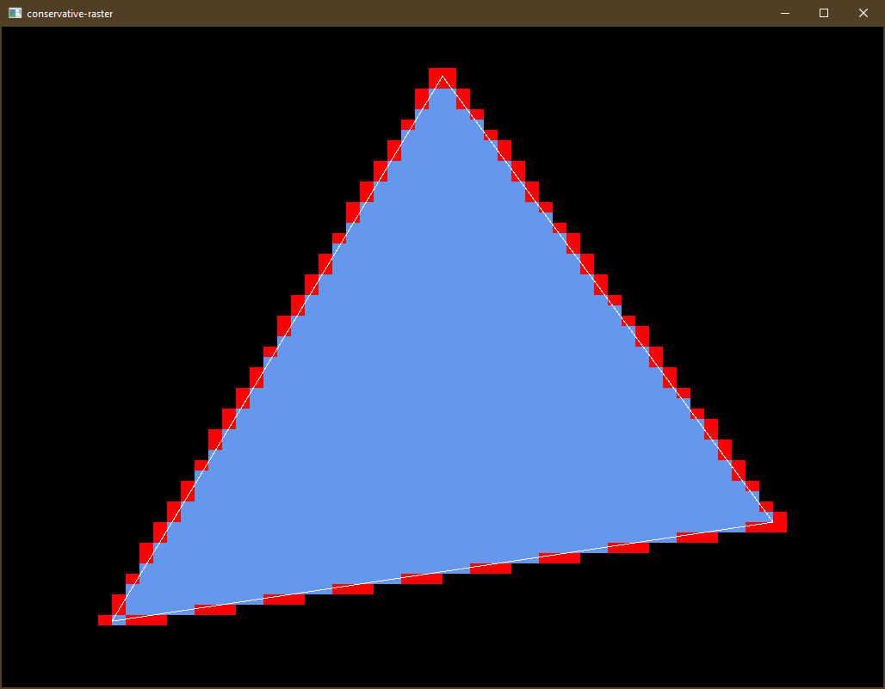

# conservative-raster

This example shows how to render with conservative rasterization (native extension with limited support).

When enabled, any pixel touched by a triangle primitive is rastered.
This is useful for various advanced techniques, most prominently for implementing realtime voxelization.

The demonstration here is implemented by rendering a triangle to a low-resolution target and then upscaling it with nearest-neighbor filtering.
The outlines of the triangle are then rendered in the original solution, using the same vertex shader as the triangle.

## To Run

```
cargo run --example conservative-raster
```

## Screenshots


